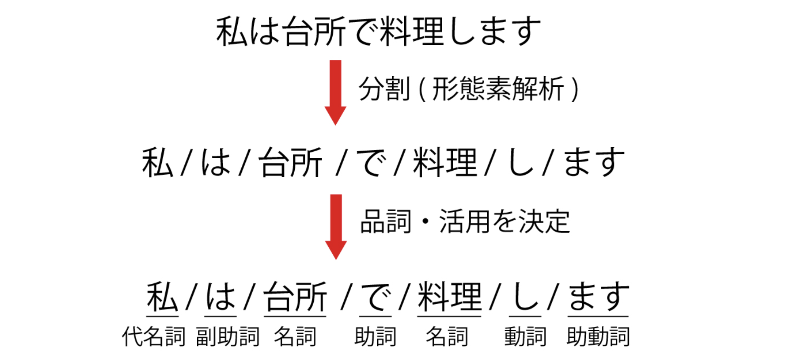

# 自然言語処理とは

このチャプターでは，自然言語処理とは何かについて簡潔に解説していきます。


## 自然言語と人工言語
自然言語処理を理解する前に，まずは**自然言語**とそれに対比する**人工言語**を見ていきましょう。

* 自然言語：我々が日常的に話す言語（日本語，英語...）
* 人工言語：プログラミング言語（Python，Java...），マークアップ言語（HTML...）


## 自然言語処理
自然言語処理（NLP：Natural Language Processing）とは，文字通り自然言語を処理する技術を指します。

下記に自然言語処理のタスク例をあげます。

* **形態素解析**
* **構文解析**
* **意味解析**
* **文脈解析**
* テキスト分類
* 機械翻訳
* 情報抽出
* 質問応答
* 情報検索
* etc...

中でも，上4つ（形態素解析，構文解析，意味解析，文脈解析）は**基礎技術**です。基礎技術は自然言語処理タスクの要素として利用されます。

[^1]: （それ以外は応用技術）


## 形態素解析
形態素解析とは，テキストを形態素（意味を持つ最小単位）に分割し，**各要素に対して品詞を付与する**処理のことです。

[](https://udemy.benesse.co.jp/ai/morphological-analysis.html)

この処理はタグ付け（tagging）とも呼ばれ，形態素解析器は別名タガー（tagger）とも呼ばれます。


### 実践
よく使われる形態素解析器として，<ruby>MeCab<rp>(</rp><rt>メカブ</rt><rp>)</rp></ruby>があります。
> MeCabはオープンソースの形態素解析エンジンで、奈良先端科学技術大学院大学出身、現GoogleソフトウェアエンジニアでGoogle 日本語入力開発者の一人である工藤拓によって開発されている。名称は開発者の好物「和布蕪」から取られた。

MeCabは高性能かつ高速に動作する形態素解析器です。またPythonには<ruby>Janome<rp>(</rp><rt>ジャノメ</rt><rp>)</rp></ruby>というパッケージがあり，MeCabに比べ性能は劣りますが，インストールやアプリケーションへの組み込みやすさから高い人気を得ています。

ここでは，Janomeを利用して形態素解析を試してみましょう。

```sh
$ pip install janome
```

インストール後，コマンドラインから`janome`と打つと，入力待ちの状態になります。ここでテキストを入力すると，解析結果が表示されます。

```sh
$ janome
私は台所で料理します

私      名詞,代名詞,一般,*,*,*,私,ワタシ,ワタシ
は      助詞,係助詞,*,*,*,*,は,ハ,ワ
台所    名詞,一般,*,*,*,*,台所,ダイドコロ,ダイドコロ
で      助詞,格助詞,一般,*,*,*,で,デ,デ
料理    名詞,サ変接続,*,*,*,*,料理,リョウリ,リョーリ
し      動詞,自立,*,*,サ変・スル,連用形,する,シ,シ
ます    助動詞,*,*,*,特殊・マス,基本形,ます,マス,マス
```
